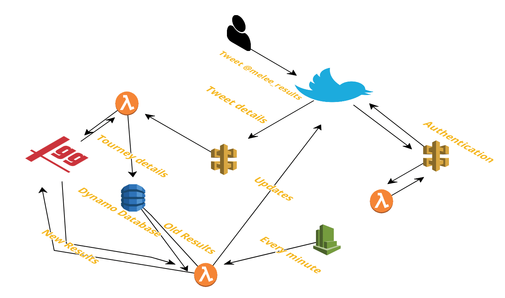

# SmashTwitterBot

Twitter tag:\@melee_results \
# How does it work? \
**The short version**\
When someone mentions the twitter bot in a tweet along with the name of a tournament,
it will tweet live updates of the finals of that tournament. \

**The long version**\
There are two main parts to the program:\
1. The watcher
2. The scanner

### The watcher
The watcher consists of a twitter webhook that is setup to receive any alerts about
the melee_results twitter account. When this webhook triggers, it will call the authentication
lambda through an API Gateway which will send a CRC back. If this succeeds, it sends the tweet data
to another API Gateway which forwards it to a lambda function. This lambda function parses
the notification and checks if it is a mention. If it is, it will gather the text of the body
and query smash.gg for a tournament using GraphQL. If smash.gg successfully returns a tournament,
the lambda writes its details to a DynamoDB table. The tournament is now registered to be watched.
If anything goes wrong in the above steps the lambda will write back to twitter with an error message.

### The scanner
The scanner lambda gets kicked off by a cloudwatch timer every minute. It gets all
active tournament entries from the database and queries smash.gg for their status.
It then compares the data stored in the database with the fresh data received. If
there are any differences, it will format them and tweet the update out. It will then
store the new version back into the database.
